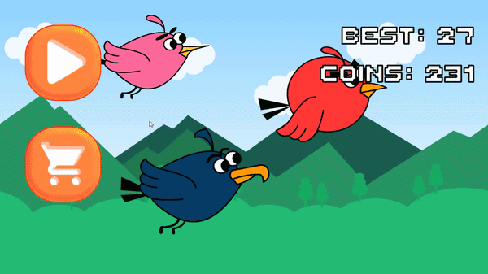
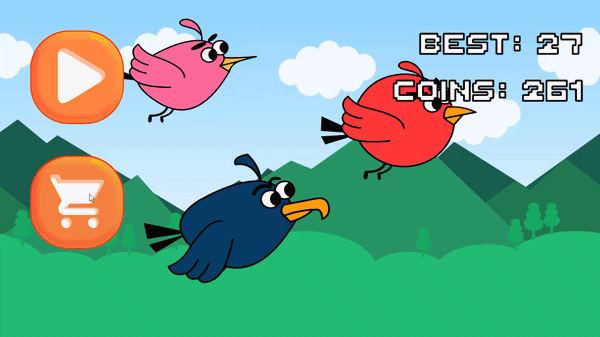
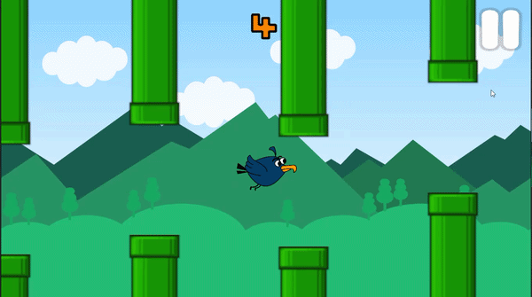

# 🐦 Flappy Bird - Unity 2D


Учебный проект - демонстрация применения **Zenject**, **UniRx**, **MVVM** и **Ads SDK** в контексте мобильной игры на Unity.

---

## 🎥 Демонстрация








---

## 🏗️ Архитектура

Проект разделён на три слоя по принципу Clean Architecture:

```
Assets/Game/
├── Core/            - интерфейсы и сигналы, ноль Unity-зависимостей
├── Infrastructure/  - реализации сервисов, персистентность
├── Presentation/    - MonoBehaviour, только отображение и ввод
├── Menu/            - ViewModels (чистый C#, без MonoBehaviour)
├── Skins/           - ScriptableObject-данные скинов
└── Installers/      - Zenject-конфигурация по сценам
```

Каждый слой - отдельная **Assembly Definition**. Зависимости между слоями контролируются компилятором: `Game.Core` физически не может импортировать `Game.Presentation`. Нарушение архитектуры = ошибка компиляции.

Коммуникация между слоями - через **SignalBus**: `PlayerDiedSignal`, `PlayerScoredSignal`. Ни один модуль не знает о существовании другого напрямую.

Платформенный ввод (`DesktopInputService` / `MobileInputService`) подменяется через DI по директиве компилятора - без единого `#if` в игровом коде.

---

## ⚙️ Стек

| | |
|---|---|
| DI | Zenject - ProjectContext / SceneContext, SignalBus, MonoMemoryPool |
| Reactive | UniRx - ReactiveProperty, CompositeDisposable, CombineLatest |
| Паттерн | MVVM - ViewModel чистый C#, View только подписывается |
| Данные | ScriptableObject (SkinDef + SkinCatalog) |
| Монетизация | Yandex Mobile Ads SDK (Banner с DPI-адаптацией) |
| UI | Unity UI Canvas + TextMeshPro |
| Сборки | Assembly Definitions - контроль зависимостей на уровне компилятора |

---

## 💡 Что показывает проект

- **Object Pool** через `Zenject.MonoMemoryPool` - трубы переиспользуются, аллокаций в рантайме нет
- **Реактивный UI** - никакого `Update()` в View, только декларативные подписки на ViewModel
- **Система скинов** - 9 персонажей, 3 ценовых тира (0 / 10 / 20 / 30 монет), индивидуальный коллайдер под форму каждого спрайта, персистентность между сессиями
- **Параллакс** через `MaterialPropertyBlock` - без создания лишних материал-инстансов
- **Адаптация под любой экран** - фон и параллакс масштабируются под aspect ratio и пересчитывают tiling в рантайме; баннер Yandex запрашивает размер в dp под DPI конкретного устройства

---

## 🔍 Примеры кода

**SignalBus - модули общаются через события, не зная друг о друге:**

```csharp
// PlayerDeathHandler - просто стреляет сигнал
_signalBus.Fire<PlayerDiedSignal>();

// PipeMover, ScoreService, GameSessionService - каждый слушает независимо
private void OnEnable()  => _bus.Subscribe<PlayerDiedSignal>(OnPlayerDied);
private void OnDisable() => _bus.TryUnsubscribe<PlayerDiedSignal>(OnPlayerDied);
```

**MVVM + UniRx - View не знает когда обновляться, просто подписан:**

```csharp
// ScoreTextView.cs
_vm.Score
    .Subscribe(value => ScoreText.text = value.ToString())
    .AddTo(_cd);

// GameOverViewModel.cs - видимость экрана = производная от состояния сессии
_session.State
    .Subscribe(s => _isVisible.Value = s == GameState.GameOver)
    .AddTo(_cd);
```

---

## 🧠 Решения и выводы

**Почему SignalBus, а не C# events?**
C# events создают прямую зависимость: `PipeMover` должен знать о `PlayerDeathHandler`, чтобы подписаться. SignalBus убирает эту связь - отправитель и получатель не знают друг о друге. Новую систему можно подключить к существующему сигналу без изменения чужого кода.

**Почему Zenject MonoMemoryPool, а не самописный пул?**
Самописный пул - это либо синглтон, либо зависимость, которую нужно пробрасывать вручную. `MonoMemoryPool` встраивается в DI-граф: спавнер получает пул через конструктор и не знает, откуда тот берёт объекты. Zenject сам управляет инициализацией при Spawn и очисткой при Despawn.

**Почему ViewModel - чистый C#, а не MonoBehaviour?**
MonoBehaviour привязан к жизненному циклу GameObject. Чистый C# класс живёт ровно столько, сколько нужно, и создаётся Zenject'ом без присутствия на сцене. Такое разделение механически не позволяет смешивать логику с отображением.

---

## 🚀 Как запустить

1. Клонировать репозиторий
2. Открыть в **Unity 6000.0.39f1**
3. Открыть сцену `Assets/Scenes/GameScene.unity`
4. Нажать Play

> Zenject и UniRx находятся в папке `Plugins` - дополнительная установка не требуется. В Editor автоматически используется `DesktopInputService` (мышь / Space) и демо-баннер Yandex.
